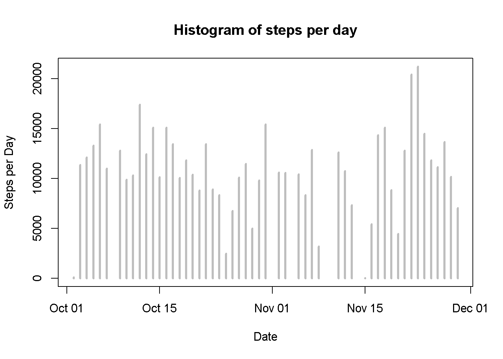
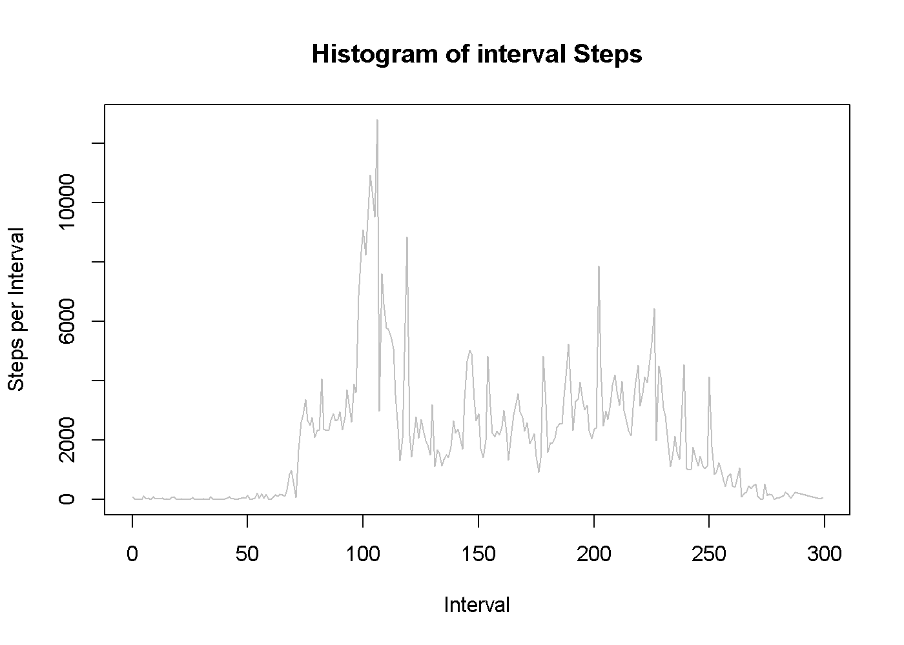
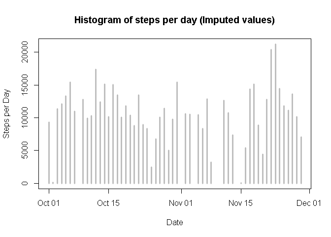
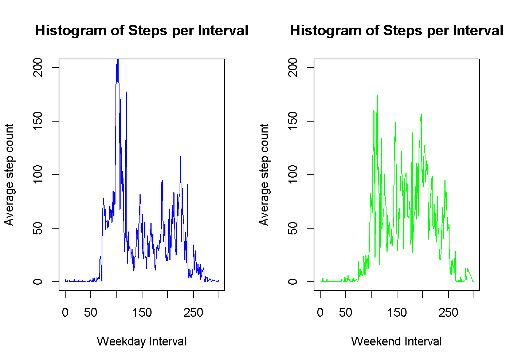

# Reproducible Research: Peer Assessment 1

The data considered in this paper comprises of a set of readings of the number
of steps a single individual took over a two month period, each reading 
corresponding to a five minute time period. There are 288 readings per 
day, and 61 days (October 2012 - November 2012) in the provided dataset i.e. a 
total of 17,568 observations.  


### Loading and preprocessing the data  <!-- 1.1, 1.2 -->


The data is read directly from the provided .zip file which contains a 
single .csv file with column names in the first row, creating the *__rawdata__* 
dataframe.  A summary of this raw dataframe is shown below.

```r
rawData = read.csv(unz("activity.zip","activity.csv"), stringsAsFactors=FALSE)
summary(rawData)
```

```
##      steps            date              interval     
##  Min.   :  0.00   Length:17568       Min.   :   0.0  
##  1st Qu.:  0.00   Class :character   1st Qu.: 588.8  
##  Median :  0.00   Mode  :character   Median :1177.5  
##  Mean   : 37.38                      Mean   :1177.5  
##  3rd Qu.: 12.00                      3rd Qu.:1766.2  
##  Max.   :806.00                      Max.   :2355.0  
##  NA's   :2304
```
This summary of the raw data indicates the presence of missing values 
(denoted by 'NA' in the file) in the *__steps__* column.  For the purposes of 
this study the rows with a missing *__steps__* value will initially be removed 
to provide the 'step data' dataframe. The character values in the *__date__* 
column are transformed to date values in order to enable processing these values 
as dates. The summary of the transformed *__stepData__* dataframe is shown below.

```r
stepData = rawData[complete.cases(rawData[,c(1)]),]
stepData$intno = round(stepData$interval/100)*12 + (stepData$interval %% 100)/5
stepData$date = as.Date(stepData$date, '%Y-%m-%d')
summary(stepData)
```

```
##      steps             date               interval          intno       
##  Min.   :  0.00   Min.   :2012-10-02   Min.   :   0.0   Min.   :  0.00  
##  1st Qu.:  0.00   1st Qu.:2012-10-16   1st Qu.: 588.8   1st Qu.: 73.75  
##  Median :  0.00   Median :2012-10-29   Median :1177.5   Median :145.50  
##  Mean   : 37.38   Mean   :2012-10-30   Mean   :1177.5   Mean   :145.00  
##  3rd Qu.: 12.00   3rd Qu.:2012-11-16   3rd Qu.:1766.2   3rd Qu.:217.25  
##  Max.   :806.00   Max.   :2012-11-29   Max.   :2355.0   Max.   :299.00
```


### What is mean total number of steps taken per day?   


In order to examine the step activity across the two months contained in the 
dataset, the data is aggregated over the intervals in a day using the *__date__*
value. This provides the *__stepsPerDay__* dataframe containing the total number 
of steps per day.

```
## Loading required package: gsubfn
## Loading required package: proto
## Loading required package: RSQLite
## Loading required package: DBI
```

```r
stepsPerDay = aggregate(stepData$steps, list(stepData$date), sum)
meanSteps = mean(stepsPerDay$x)
medianSteps = median(stepsPerDay$x)
```
The mean,  __10766__, and 
median, __10765__ 
number of steps per day was calculated from this dataframe (histogrammed below),

```r
plot(stepsPerDay$Group.1, 
     stepsPerDay$x, 
     type="h", 
     main="Histogram of steps per day", 
     xlab="Date", 
     ylab="Steps per Day", 
     col="grey", 
     lwd=3)  
```




### What is the average daily activity pattern?


In order to look at the pattern of activity within a day, averaged over the two 
month period, the step data was aggregated across intervals producing the 
*__aggSteps__* dataframe. This is shown in the histogram below where the total 
number of steps per interval across the two month period is plotted against the 
interval number.

```r
aggSteps = aggregate(stepData$steps, list(stepData$intno), sum)
plot(aggSteps$Group.1, aggSteps$x, type="l", main="Histogram of interval Steps",
     xlab="Interval", ylab="Steps per Interval", col="grey", lwd=1
)
```


  
  
### Imputing missing values

From the summary of the *__rawData__* dataframe above we can see that there are 
2304 rows with no step 
count. In order to cope with the intervals in which the step readings were 
unavailable for whatever reason, the values recorded as 'NA' can be imputed from 
the 'step context' around the values.  The simple strategy of assigning a value 
based on the avarage for that interval across all days will be adopted.  This 
corresponds to the assumption that the pattern of activity is regular across the 
days in the sample e.g. the level of step activity at for instance 11 o'clock 
each day would tend to be the same.  This can be accomplished as follows.

```r
impRawData = subset(rawData)
impRawData$steps = ifelse(is.na(impRawData$steps), 0, impRawData$steps)
meanIntervalSteps = aggregate(impRawData$steps, list(impRawData$interval), mean)
for (i in 1:nrow(rawData))
    if (is.na(rawData[i,"steps"]))
        impRawData[i,"steps"] = meanIntervalSteps[i,"x"]
stepData = impRawData[complete.cases(impRawData[,c(1)]),]
stepData$intno = round(stepData$interval/100)*12 + (stepData$interval %% 100)/5
stepData$date = as.Date(stepData$date, '%Y-%m-%d')
summary(stepData)
```

```
##      steps             date               interval          intno       
##  Min.   :  0.00   Min.   :2012-10-01   Min.   :   0.0   Min.   :  0.00  
##  1st Qu.:  0.00   1st Qu.:2012-10-15   1st Qu.: 588.8   1st Qu.: 73.75  
##  Median :  0.00   Median :2012-10-28   Median :1177.5   Median :145.50  
##  Mean   : 37.29   Mean   :2012-10-30   Mean   :1177.5   Mean   :145.00  
##  3rd Qu.: 15.00   3rd Qu.:2012-11-16   3rd Qu.:1766.2   3rd Qu.:217.25  
##  Max.   :806.00   Max.   :2012-11-29   Max.   :2355.0   Max.   :299.00
```
Reforming the stepData datframe from the data with the imputed values we can 
then recalculate the mean and median values for the steps per day.

```r
stepsPerDay = aggregate(stepData$steps, list(stepData$date), sum)
meanSteps = mean(stepsPerDay$x)
medianSteps = median(stepsPerDay$x)
```
For the dataframe with the imputed step values the mean,  
__10740__, and median, 
__10682__ show little change suggesting that the 'NA' 
values occured during intervals where the average was fairlt low. The datafreame 
with the imputed values is histogrammed below


```r
plot(stepsPerDay$Group.1, 
     stepsPerDay$x, 
     type="h", 
     main="Histogram of steps per day (Imputed values)", 
     xlab="Date", 
     ylab="Steps per Day", 
     col="grey", 
     lwd=3)
```

 

### Are there differences in activity patterns between weekdays and weekends?


Using the data with imputed steps counts, it's interesting to split the data 
into two subsets, dependant on whether or not the samples were taken at the 
weekend or during the working week.  These subsets are formed below

```r
stepData$weekend = factor(ifelse(format(stepData$date, "%u") %in% c(1,2,3,4,5), 'N','Y'))
weekDays = subset(stepData, format(stepData$date, "%u") %in% c(1,2,3,4,5))
Weekends = subset(stepData, format(stepData$date, "%u") %in% c(6,7))
WeekDaysAgg = aggregate(weekDays$steps, list(weekDays$intno), mean)
WeekendsAgg = aggregate(Weekends$steps, list(Weekends$intno), mean)
par(mfrow = c(1,2))
plot(WeekDaysAgg$Group.1, 
     WeekDaysAgg$x, 
     type="l",
     main="Histogram of Steps per Interval",
     xlab="Weekday Interval", 
     ylab="Average step count", 
     col="blue", 
     lwd=1, 
     ylim=c(0,200)
)
plot(WeekendsAgg$Group.1, 
     WeekendsAgg$x, 
     type="l",
     main="Histogram of Steps per Interval",
     xlab="Weekend Interval", 
     ylab="Average step count", 
     col="green", 
     lwd=1, ylim=c(0,200)
)
```



These plots show a difference between weekend and weekday activity. There would 
seem to be considerably more step activity during the weekend day as compared 
to the normal working day.
